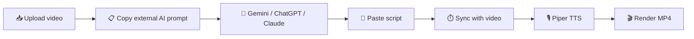
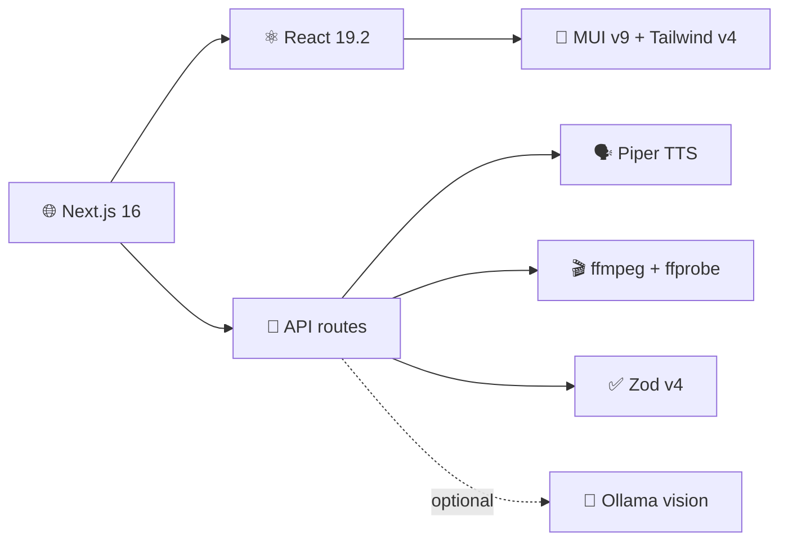
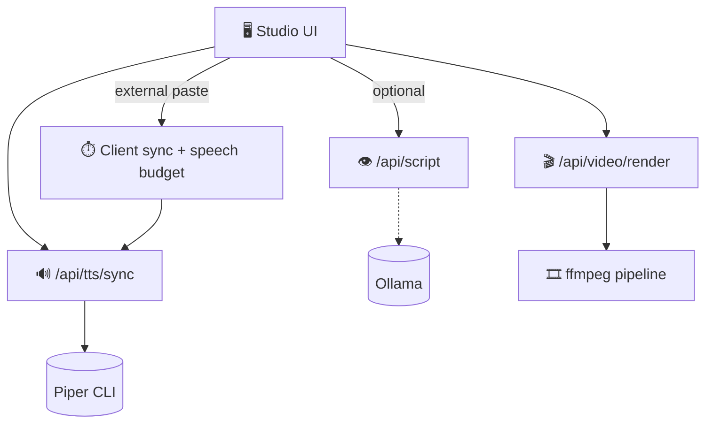

<div align="center">

# 🎬 Frameline

### **Vision × Voice — professional narrated video, end to end**

✨ Upload a clip · write or import a script · synthesize voice · trim · merge · export — voiceover and burned-in captions in a single server-side ffmpeg pass.

[](https://nextjs.org/)
[](https://react.dev/)
[](https://www.typescriptlang.org/)
[](https://mui.com/)
[](https://tailwindcss.com/)
[](./Dockerfile)
[](./helm/)
[](https://ffmpeg.org/)

</div>

---

## 📖 Overview

**Frameline** is a self-hosted video narration studio built on **Next.js 16**, **Piper TTS**, and **ffmpeg**. It supports two script paths:

| Mode                     | Best for                             | Script source                                        | Vision model                     |
| ------------------------ | ------------------------------------ | ---------------------------------------------------- | -------------------------------- |
| 🏠 **Local development** | Offline / full-stack on your machine | **Generate** button (Ollama) _or_ external AI prompt | Ollama `minicpm-v:8b` (optional) |
| ☁️ **Production (EKS)**  | Team deploys via Docker + Helm       | **External AI prompt** (Gemini, ChatGPT, …)          | Disabled by default              |

In production, users copy a structured prompt from the studio, run it in an external AI tool with their video, paste the narration back, sync timestamps, voice it with Piper, and render — **no Ollama required in the cluster**.

---

## 🧠 Models — downloaded once

Piper voices and binaries are **not** fetched on every pod start or every request.

| Environment                | When models download                              | Stored where                      | Re-download?                                                                   |
| -------------------------- | ------------------------------------------------- | --------------------------------- | ------------------------------------------------------------------------------ |
| 💻 **Local dev**           | First `npm run setup:models`                      | `./models/` (gitignored)          | ❌ No — script is **idempotent** (skips existing files)                        |
| 🐳 **Docker / EKS**        | **`docker build`** (`setup-models --skip-ollama`) | Baked into image at `/app/models` | ❌ No — each **new image tag** rebuilds the layer; running pods just read disk |
| 🦙 **Ollama (local only)** | `ollama pull` via setup script                    | Ollama daemon store               | Managed by Ollama                                                              |

```bash
# Local — safe to re-run; skips anything already on disk
npm run setup:models              # Ollama + Piper
npm run setup:models -- --skip-ollama   # Piper only (production parity)
```

> 📦 **Production images** install Piper during the Docker **builder** stage and `COPY` `/app/models` into the final image. Kubernetes pods inherit the weights — no init container, no runtime download.

---

## 🚀 Quick start (local)

1️⃣ **Clone & install**

```bash
git clone https://github.com/Deloitte-Default/frameline.git
cd frameline
npm install
```

2️⃣ **Install models** (once per machine)

```bash
# Full local stack (Ollama vision + Piper TTS)
npm run setup:models
```

Install [Ollama](https://ollama.com/download) first and keep the daemon running for the **Generate** button.

3️⃣ **Run**

```bash
npm run dev
```

🌐 **Studio:** <http://localhost:3000/studio> · **Home:** <http://localhost:3000>

---

## 🎛️ Studio workflows

### ☁️ Production — external AI prompt (default on EKS)



1. 📥 Upload clip · set **tone** · optional **additional context** (README, product notes)
2. 📋 Expand **External AI prompt** → copy prompt (includes word budget + temporal sync rules)
3. 🤖 Paste into an AI tool that can watch the video — **visual-only**, ignore clip audio
4. 📝 Paste plain-text narration into the script editor
5. ⏱️ **Sync with video** — timestamps rebalance to clip length
6. 🎙️ **Voice** tab → synthesize synced MP3
7. 🎬 **Export** → trim · mux voiceover · burn captions

### 🏠 Local — optional Ollama Generate

When `FRAMELINE_ENABLE_LOCAL_VISION=true` (default in dev), the **Generate AI script** button calls `/api/script` (Ollama vision). External prompt + paste still works side by side.

---

## ✨ Features

|                                 |                                                                                                                                                                          |
| ------------------------------- | ------------------------------------------------------------------------------------------------------------------------------------------------------------------------ |
| 📋 **Unified prompts**          | Single source of truth in [`lib/studio/transcript-prompt.ts`](./lib/studio/transcript-prompt.ts) — external + Ollama share word budget, visual-only rules, temporal sync |
| 🤖 **External AI prompt panel** | Copy-ready prompt with numbered steps, word targets, and duration stats                                                                                                  |
| 📂 **Additional context**       | README / product notes injected into external prompt (and Ollama when enabled)                                                                                           |
| ⏱️ **Speech budget sync**       | ~2% runtime headroom (`SPEECH_FILL_MARGIN`) so closing lines are not clipped; paragraph-aware trim                                                                       |
| 👁️ **Local vision**             | MiniCPM-V 2.6 via Ollama — multi-frame script with shortfall recovery (dev / opt-in prod)                                                                                |
| 🎙️ **12 Piper voices**          | US & UK English — Amy, Ryan, Alan, Jenny, Lessac, Kathleen, Joe, John, Norman, LJSpeech, Alba, Cori                                                                      |
| 🎬 **One-pass render**          | `trim → mux voiceover → burn captions` in one ffmpeg run                                                                                                                 |
| ▶️ **YouTube-style player**     | Scrubber, speed (0.25×–2×), fullscreen, keyboard shortcuts                                                                                                               |
| 🌊 **Wavesurfer preview**       | Lazy-loaded waveform player for voice samples and synced tracks                                                                                                          |
| ✂️ **Timeline & library**       | Frame-precise trim, clip-in-place, multi-clip merge                                                                                                                      |
| 🌓 **Light / dark mode**        | Cookie-persisted, SSR-correct first paint                                                                                                                                |
| 🌍 **i18n**                     | `next-intl` — English + Spanish (`locales/<lang>/`)                                                                                                                      |
| 🔒 **Privacy-first**            | No cloud LLM APIs required in production; all processing on your infrastructure                                                                                          |

---

## 🛠️ Tech stack



---

## 🏗️ Architecture



🔧 Pipeline builder: [`lib/ffmpeg/pipeline.ts`](./lib/ffmpeg/pipeline.ts) — one ffmpeg invocation per request.

📝 **Prompt & budget layer:** [`lib/format/speech-budget.ts`](./lib/format/speech-budget.ts) + [`lib/studio/transcript-prompt.ts`](./lib/studio/transcript-prompt.ts).

---

## 🔑 Environment variables

| Variable                        | Default                               | Purpose                             |
| ------------------------------- | ------------------------------------- | ----------------------------------- |
| `FRAMELINE_ENABLE_LOCAL_VISION` | `true` in dev · `false` in prod image | **Generate** button + `/api/script` |
| `FRAMELINE_MODELS_DIR`          | `./models` / `/app/models` in Docker  | Piper install root                  |
| `PIPER_BIN`                     | `models/piper/piper`                  | Piper executable                    |
| `PIPER_VOICES_DIR`              | `models/piper/voices`                 | `.onnx` voice files                 |
| `PIPER_DEFAULT_VOICE`           | `amy`                                 | Default voice id                    |
| `OLLAMA_BASE_URL`               | `http://localhost:11434`              | Only when local vision enabled      |
| `OLLAMA_VISION_MODEL`           | `minicpm-v:8b`                        | Vision model tag                    |

📄 Templates: [`.env.development`](./.env.development) · [`.env.production`](./.env.production)

> 🐳 **`NODE_ENV=production`** is set in the Dockerfile only (build + runner). Helm does not need to repeat it — containers inherit it from the image.

---

## 🚢 Deploy to EKS

### 🐳 Docker image

[`Dockerfile`](./Dockerfile) — multi-stage build:

- 📦 `npm ci` → `next build` (standalone output)
- 🗣️ `setup-models --skip-ollama` — **Piper baked once** into `/app/models`
- 🚀 `node server.js` on port `3000`

```bash
docker build \
  --build-arg FRAMELINE_ENABLE_LOCAL_VISION=false \
  --build-arg PIPER_DEFAULT_VOICE=amy \
  -t frameline:latest .

docker run --rm -p 3000:3000 frameline:latest
```

### ⎈ Helm chart

[`helm/`](./helm/) — Deployment (or Argo Rollout), Service, Ingress.

```bash
kubectl create namespace frameline

kubectl -n frameline create secret generic frameline-env \
  --from-literal=FRAMELINE_ENABLE_LOCAL_VISION=false \
  --from-literal=PIPER_DEFAULT_VOICE=amy

helm upgrade --install frameline ./helm \
  --namespace frameline \
  --create-namespace \
  --set app.image=<ecr-registry>/frameline:<tag> \
  --set ingress.host=frameline.example.com
```

| Setting             | Notes                                                   |
| ------------------- | ------------------------------------------------------- |
| `rollout.enabled`   | `true` for Argo Rollouts canary (needs CRD)             |
| Ingress annotations | 220 MB body limit · 600 s proxy timeouts for render/TTS |
| Probes              | HTTP `GET /`                                            |

### 🤖 GitHub Actions

[`.github/workflows/deploy-eks.yml`](./.github/workflows/deploy-eks.yml) — on push to `main` / `master`:

| Job                | What it does                                                                    |
| ------------------ | ------------------------------------------------------------------------------- |
| **build-and-push** | 🐳 Build root `Dockerfile` → push to **GHCR** (`ghcr.io/<org>/frameline:<sha>`) |
| **deploy**         | 🔐 AWS OIDC → 🔑 sync `frameline-env` → ⎈ `helm upgrade --install`              |

**Repository variable** (optional): `GHCR_IMAGE` — full image repo without tag, e.g. `ghcr.io/deloitte-default/frameline`. Defaults to `ghcr.io/<github.repository>`.

**Docker build-args** (from secrets):

| Secret                          | Default | Purpose                        |
| ------------------------------- | ------- | ------------------------------ |
| `FRAMELINE_ENABLE_LOCAL_VISION` | `false` | Baked into image at build time |
| `PIPER_DEFAULT_VOICE`           | `amy`   | Default Piper voice            |

**Deploy secrets** (required for EKS job):

| Secret             | Purpose                                               |
| ------------------ | ----------------------------------------------------- |
| `AWS_REGION`       | EKS region                                            |
| `AWS_ROLE_ARN`     | OIDC role for `aws-actions/configure-aws-credentials` |
| `EKS_CLUSTER_NAME` | Target cluster                                        |
| `K8S_INGRESS_HOST` | Ingress hostname for Helm                             |

**Optional secrets:**

| Secret                 | Purpose                                     |
| ---------------------- | ------------------------------------------- |
| `IMAGE_PULL_SECRET`    | K8s secret name for GHCR pull (e.g. `ghcr`) |
| `HELM_ROLLOUT_ENABLED` | `true` → Argo Rollout instead of Deployment |

> 📦 **GHCR:** workflow uses `GITHUB_TOKEN` with `packages: write`. Ensure the cluster can pull from GHCR (configure `IMAGE_PULL_SECRET` if the repo is private).

---

## 📜 npm scripts

| Script                 | Purpose                                |
| ---------------------- | -------------------------------------- |
| `npm run dev`          | 🔥 Dev server (Turbopack)              |
| `npm run build`        | 📦 Production build                    |
| `npm run start`        | 🚀 Production server                   |
| `npm run setup:models` | 🧠 Install Ollama + Piper (idempotent) |
| `npm run lint`         | 🧹 ESLint (zero warnings)              |
| `npm run type:check`   | 🧪 TypeScript                          |
| `npm run format:check` | ✅ Prettier                            |

> 🐶 Husky pre-commit: Prettier → `lint:fix` → `type:check`

---

## 🔌 API reference

| Method | Route               | Notes                                                             |
| ------ | ------------------- | ----------------------------------------------------------------- |
| `POST` | `/api/script`       | Ollama vision → script · requires `FRAMELINE_ENABLE_LOCAL_VISION` |
| `POST` | `/api/tts`          | Piper TTS → `audio/mpeg`                                          |
| `POST` | `/api/tts/sync`     | Segmented sync → `{ audioBase64, segments }`                      |
| `GET`  | `/api/tts/preview`  | Voice preview sample                                              |
| `POST` | `/api/video/render` | Trim · mux · burn captions                                        |
| `POST` | `/api/video/cut`    | Trim download                                                     |
| `POST` | `/api/video/clip`   | Trim inline (library)                                             |
| `POST` | `/api/video/concat` | Multi-clip merge                                                  |

❗ Errors: JSON `{ code, error }` — localized in [`locales/*/errors.json`](./locales/en/errors.json).

---

## 📁 Project structure

```text
app/
  studio/                   🎬 Studio workspace
  api/
    script/                 👁️ Ollama vision (optional)
    tts/                    🔊 Piper TTS + sync
    video/                  🎞️ render · cut · clip · concat
helm/                       ⎈ EKS Helm chart
deploy/docker/              🐳 entrypoint.sh
scripts/setup-models.mjs    📥 One-time model installer
lib/
  studio/transcript-prompt.ts  📋 Prompt single source of truth
  format/speech-budget.ts      ⏱️ Word budget + sync trim
  ffmpeg/                   🎬 Pipeline + operations
  providers/                🤖 Ollama + Piper
components/studio/          🎛️ Workspace UI
locales/                    🌍 i18n message bundles
models/                     📦 Piper + Ollama weights (gitignored locally)
```

---

## 🌍 Internationalization · 🎨 Theming · 🛡️ Security

- 🍪 Locale via **`FRAMELINE_LOCALE`** cookie · English + Spanish
- 🎨 Design tokens in [`lib/theme/design-tokens.ts`](./lib/theme/design-tokens.ts)
- ✅ Zod validation on every API boundary
- 🧹 Ephemeral temp dirs per request — auto-cleaned
- 📏 200 MB upload limit · MIME checks on video/audio

---

## 🩹 Troubleshooting

<details>
<summary>🗣️ Piper not found</summary>

Local: `npm run setup:models`. Docker: rebuild image — Piper must exist at `/app/models/piper/piper`.

</details>

<details>
<summary>🚫 Local vision disabled in production</summary>

Expected when `FRAMELINE_ENABLE_LOCAL_VISION=false`. Use the **External AI prompt** on the Transcript tab.

</details>

<details>
<summary>✂️ Closing narration lines cut off</summary>

Re-sync after paste. Speech budget allows ~2% headroom; keep word count within the prompt's **max words** target.

</details>

<details>
<summary>🤖 Ollama errors (local dev)</summary>

Confirm daemon is running and `ollama list` shows `OLLAMA_VISION_MODEL`.

</details>

<details>
<summary>🔇 No captions on export</summary>

Sync timestamps first, then enable **Burn captions** on Export.

</details>

---

<div align="center">

🎬 **Frameline — from clip to narrated cut, on your infrastructure.**

🏠 Local vision for dev · ☁️ External AI + Piper for production · 🐳 Models baked once in Docker

</div>
